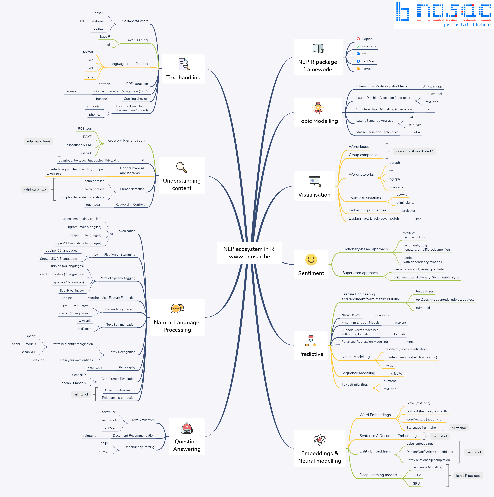

```{r setup, include=FALSE}
knitr::opts_chunk$set(echo = TRUE, warning=FALSE, message=FALSE)
```


R语言代码略带凌乱，讲真的还是更喜欢Python代码简洁。不过好几年不琢磨R语言，对R语言代码的凌乱美有些新奇，很好玩，这也许就是久别胜新欢吧。
而且R语言的文本分析生态也挺全的，Python与R结合起来，完美~


# 介绍
本章文件读写用到的包有

- readtext
- readr
- readxl
- writexl

其中readr、readxl均为tidyverse内的子包，做数据分析一般绕不开tidyverse


tidyverse含有的包
```{r}
library(tidyverse)
tidyverse::tidyverse_packages()
```


# 预备知识: tibble包
tibble比R内置的数据框的易用，默认不会将字符串转化为因子型。选择tibble数据的子集，返回的结果仍是tibble类型


- 创建数据框: tibble()
- 强制转化数据框: as_tibble()


创建数据框

```{r}

#tibble::tibble意识是导入tibble包的tibble函数
df <- tibble::tibble(
  x = c(1,2,3,4),
  name=c("张三", "李四", "王五", "赵六"),
  age=c(25, 23, 30, 18)
  )

df
```

```{r}
colnames(df)
```

```{r}
rownames(df)
```


# 读写实战
## 安装

```{r}
#install.packages(c("readtext","readr","readxl", "writexl"))
```


# 读取文件
|读取|包|代码|功能|
|:---|:---|:---|:---|
|txt|readtext|readtext()|读取txt文件|
|csv|readr|read_csv()|读取csv文件|
|excel|readxl|read_excel()|读取xls、xlsx文件|


## 读取csv
默认csv文件为utf-8编码
```{r}
#读取csv
df <- readr::read_csv('data/waimai8k.csv')
#为了展示的更好看一些
df <- DT::datatable(df)
df
```


## 读取excel文件


```{r}
df2 <- readxl::read_excel('data/data.xlsx')
df2
```

## 读txt
```{r}
document <- readtext::readtext('data/三体.txt')
document
```

```{r}
#全部显示
#document['text']

#显示前200个字符
substr(document['text'], 1, 200)
```

```{r}
document[['doc_id']]
```

```{r}
#全部显示
#document[['text']]

#显示前200个字符
substr(document[['text']], 1, 200)
```


## 导入多个txt文件
- list.files() 某路径下多个文件


```{r}
#获取文件列表
files <- list.files('data/txts', full.names=TRUE)
head(files)
```


```{r}
texts <- c()
doc_ids <- c()

for (file in files) {
  document <- readtext::readtext(file, encoding = 'gbk')
  doc_ids <- c(doc_ids, document[['doc_id']])
  texts <- c(texts, document[['text']]) #文本全部导入到tibble
  #texts <- c(texts, substr(document[['text']], 1, 50))  #截取前50个字符的文本，方便显示
}

df <- tibble::tibble(
  doc_ids=doc_ids,
  texts = texts
  )

head(df)
```


# 写入文件
|写入|包|代码|功能|
|:---|:---|:---|:---|
|csv|readr|write_csv()|将数据写入csv文件|
|excel|writexl|write_excel()|将数据写入excel|


## 存入excel
使用writexl包的write_xlsx(x, path)

- x:  tibble表数据
- path: xlsx文件路径

```{r}
#写入xlsx
writexl::write_xlsx(df, "output/reports.xlsx")
```

## 存入csv
使用readr包的write_csv(x, path)

- x:  tibble表数据
- path: csv件路径

```{r}
#写入csv
readr::write_csv(df, "output/reports.csv")
```


